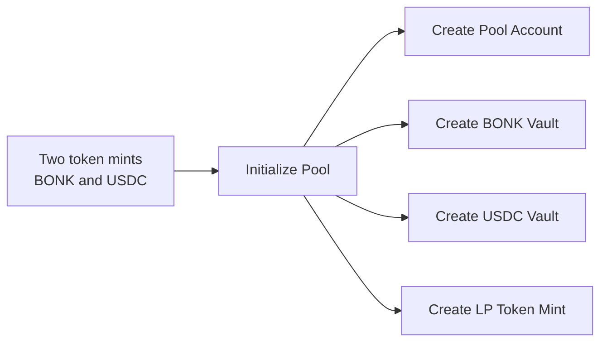
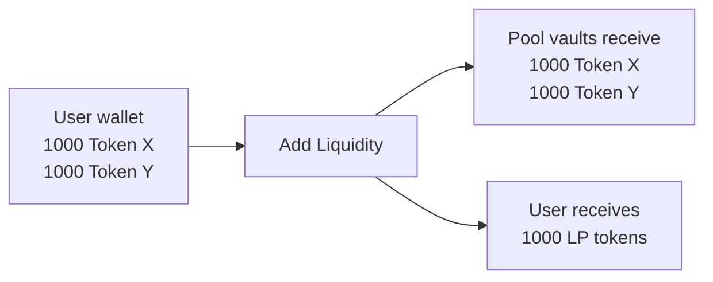
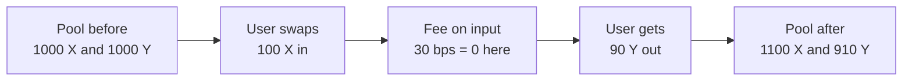
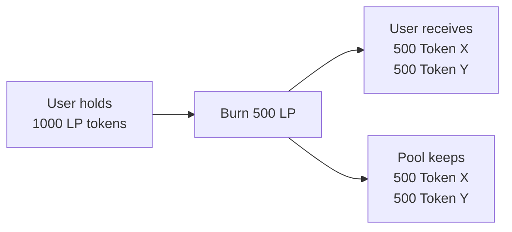
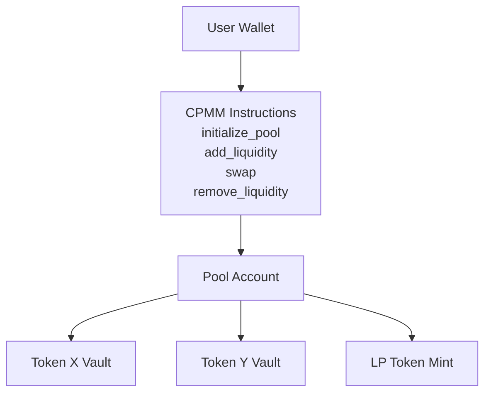

# CPMM 

Constant Product Market Maker built with Anchor.

This repo implements the core CPMM instruction surface:

- `initialize_pool`
- `add_liquidity`
- `swap`
- `remove_liquidity`


## Current Status

Implemented and tested:

- pool initialization with canonical mint ordering
- allowed fee-tier validation
- bootstrap liquidity minting
- non-bootstrap proportional liquidity deposits
- exact-input swaps in both directions
- remove-liquidity proportional redemption
- slippage failure paths for add/swap/remove
- invalid vault-routing swap checks

Not implemented yet:

- exact-output swap
- protocol/admin fee collection
- `update_fee`

## Design

### `initialize_pool`



### 1. Pool Model

Each pool stores:

- `token_mint_x`
- `token_mint_y`
- `vault_x`
- `vault_y`
- `lp_mint`
- `fee_bps`
- PDA bump

Mint ordering is canonical:

- smaller mint pubkey becomes `token_mint_x`
- larger mint pubkey becomes `token_mint_y`

This guarantees one deterministic pool PDA per token pair.

### `add_liquidity`



### 2. LP Model

LP tokens represent proportional ownership of pool reserves.

Bootstrap liquidity:

- LP shares minted = `floor(sqrt(x_in * y_in))`

Non-bootstrap liquidity:

- LP shares are minted proportionally to existing reserves and current LP supply
- only balanced amounts are consumed
- excess user budget stays with the user

Remove liquidity:

- burning LP returns the same fraction of both reserves

### `swap`



### 3. Swap Model

Swaps are implemented as exact-input:

- user supplies exact `amount_in`
- user protects execution with `min_amount_out`

Swap routing is vault-driven, not mint-driven.

That means the instruction resolves direction from:

- `input_vault`
- `output_vault`

instead of inferring direction only from user token account mints.

This is closer to how production protocols like Raydium structure swap routing.

### 4. Fee Model

Swap fee is stored per pool as `fee_bps`.

For exact-input swaps:

- fee is taken from input amount
- curve math uses the effective post-fee input
- full input is still transferred into the pool
- fee stays in pool reserves, benefiting LPs

### `remove_liquidity`



## Architecture



## Math Layout

AMM math lives in [`programs/cpmm/src/curve`](/Users/raghavsharma/Documents/cpmm/programs/cpmm/src/curve):

- [fees.rs](/Users/raghavsharma/Documents/cpmm/programs/cpmm/src/curve/fees.rs)
- [liquidity.rs](/Users/raghavsharma/Documents/cpmm/programs/cpmm/src/curve/liquidity.rs)
- [swap.rs](/Users/raghavsharma/Documents/cpmm/programs/cpmm/src/curve/swap.rs)

This keeps:

- instruction orchestration
- token CPIs
- pure AMM math

separated cleanly.

## Instruction Layout

Program entrypoint:

- [lib.rs](/Users/raghavsharma/Documents/cpmm/programs/cpmm/src/lib.rs)

Instructions:

- [initialize_pool.rs](/Users/raghavsharma/Documents/cpmm/programs/cpmm/src/instructions/initialize_pool.rs)
- [add_liquidity.rs](/Users/raghavsharma/Documents/cpmm/programs/cpmm/src/instructions/add_liquidity.rs)
- [swap/mod.rs](/Users/raghavsharma/Documents/cpmm/programs/cpmm/src/instructions/swap/mod.rs)
- [swap/checks.rs](/Users/raghavsharma/Documents/cpmm/programs/cpmm/src/instructions/swap/checks.rs)
- [remove_liquidity.rs](/Users/raghavsharma/Documents/cpmm/programs/cpmm/src/instructions/remove_liquidity.rs)

Reusable CPI helpers:

- [token.rs](/Users/raghavsharma/Documents/cpmm/programs/cpmm/src/utils/token.rs)

Pool state:

- [pool.rs](/Users/raghavsharma/Documents/cpmm/programs/cpmm/src/state/pool.rs)

## Tests

This repo uses LiteSVM-backed TypeScript integration tests instead of depending on a slow local validator loop.

Test layers:

1. Rust unit/invariant tests
2. TypeScript integration tests on LiteSVM
3. TypeScript smoke tests on LiteSVM

Current integration coverage includes:

- initialize pool happy path
- canonical mint-order rejection
- invalid fee-tier rejection
- bootstrap add-liquidity success
- add-liquidity slippage failure
- non-bootstrap add-liquidity success
- swap `x -> y`
- swap `y -> x`
- swap slippage failure
- invalid vault routing rejection
- same input/output vault rejection
- non-zero-fee swap path
- remove-liquidity success
- remove-liquidity slippage failure
- zero-burn rejection

See:

- [tests/README.md](/Users/raghavsharma/Documents/cpmm/tests/README.md)

## Commands

Install JS dependencies:

```bash
yarn install
```

Build program:

```bash
anchor build
```

Run Rust unit tests:

```bash
cargo test -p cpmm
```

Run TypeScript integration + smoke tests on LiteSVM:

```bash
yarn test
```

## Learning Note

Knowing the architecture is necessary, but not sufficient.

Good engineers do not keep every formula fresh in working memory at all times. What they usually retain is:

- the invariants
- the shape of the math
- where the formulas live
- how to re-derive or verify them quickly

For CPMMs, the bar is not “memorize everything forever.” The real bar is:

- explain the instruction flow cleanly
- know what each formula is doing
- re-derive the formula when needed
- know which pre-state and post-state changes must hold
